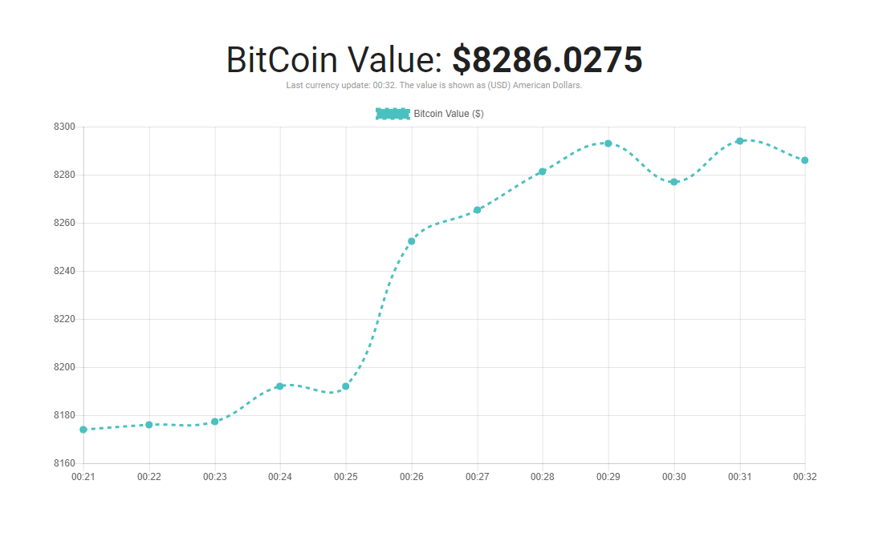

# Nabil's Bitcoin Viewer
An open-source realtime Bitcoin viewer.

## Getting Started

### Installing

- Start by cloning this project.
- Extract it anywhere on your PC.
- Open index.htm with these recommended web browsers *(Google Chrome, Firefox, Safari, Opera)*.

### Prerequisites

- Make sure you have a stable internet connection as the Bitcoin currency is retrieved by CoinDesk API.

## Features

- Realtime Bitcoin values
- 100% Client-side *
- Sleek & Professional design
- Totally free

## Contributing

Please read [CONTRIBUTING.md](CONTRIBUTING.md) for details on our code of conduct, and the process for submitting pull requests to us.

## Authors

* **Nabil El-Hayek** - *Initial work* - [Insanik](https://github.com/Insanik)

## License

This project is licensed under the MIT License - see the [LICENSE.md](LICENSE.md) file for details

## Acknowledgments

- [Chart.JS](chartjs.org) - JavaScript Chart Library (v. 2.7.1)
- [CoinDesk](chartjs.org) - Bitcoin currency API.
- [PurpleBooth](https://gist.github.com/PurpleBooth) - Readme template.

